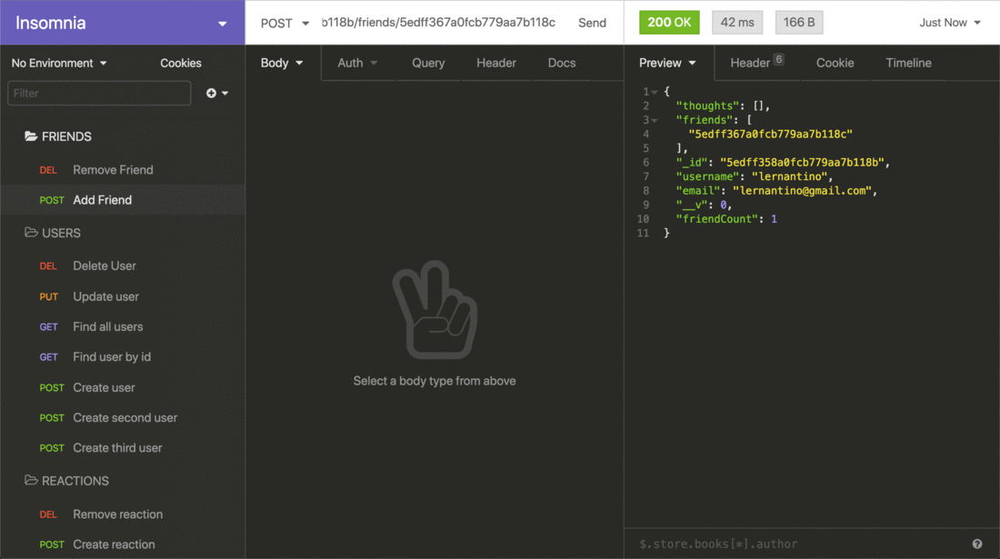

# 18 NoSQL: SocialNetwork (Backend) API

[](https://opensource.org/licenses/MIT)

## Description

This app implements a social network API backed by a NoSQL database.

## Acceptance Criteria

```md
GIVEN a social network API
WHEN I enter the command to invoke the application
THEN my server is started and the Mongoose models are synced to the MongoDB database
WHEN I open API GET routes in Insomnia for users and thoughts
THEN the data for each of these routes is displayed in a formatted JSON
WHEN I test API POST, PUT, and DELETE routes in Insomnia
THEN I am able to successfully create, update, and delete users and thoughts in my database
WHEN I test API POST and DELETE routes in Insomnia
THEN I am able to successfully create and delete reactions to thoughts and add and remove friends to a user’s friend list
```

## Usage

The following video and [link](https://drive.google.com/file/d/1RHWgxBctB2zWe23h1ReLmFpNxNod5ztQ/view?usp=sharing) show app API routes being tested in Insomnia.


The following animation shows GET routes to return all users and all thoughts being tested in Insomnia:


The following animation shows GET routes to return a single user and a single thought being tested in Insomnia:


The following animation shows the POST, PUT, and DELETE routes for users being tested in Insomnia:


In addition to this, your walkthrough video should show the POST, PUT, and DELETE routes for thoughts being tested in Insomnia.

The following animation shows the POST and DELETE routes for a user’s friend list being tested in Insomnia:



## Credits

The University of Texas at Austin. Material and instructions.

## License

This application is under the [MIT](https://opensource.org/licenses/MIT) license.

## Software

The technologies used in this project are as follow:

- JavaScript
- Node.js
- Express
- MongoDB
